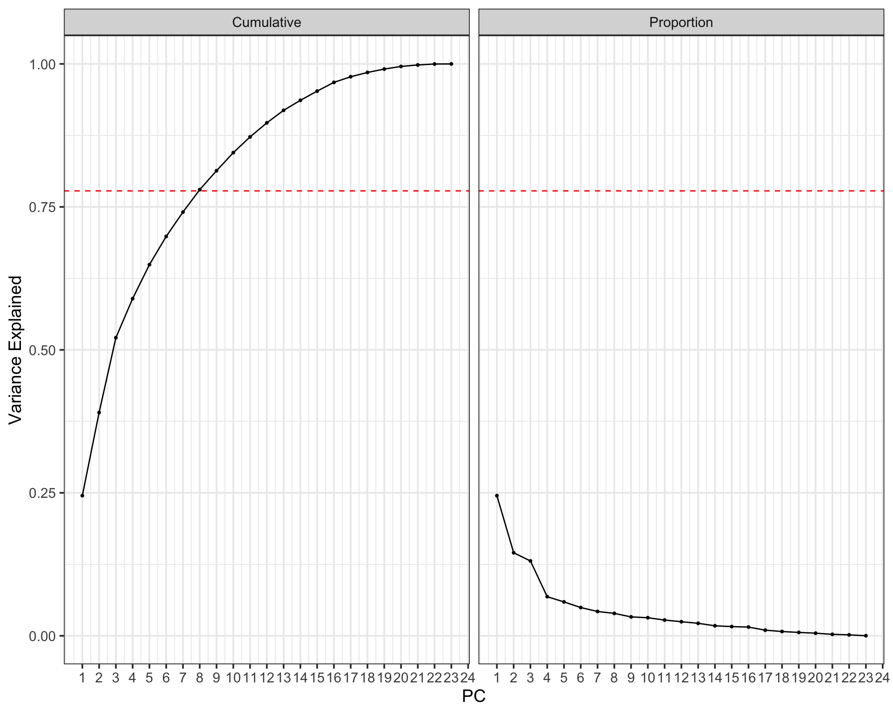
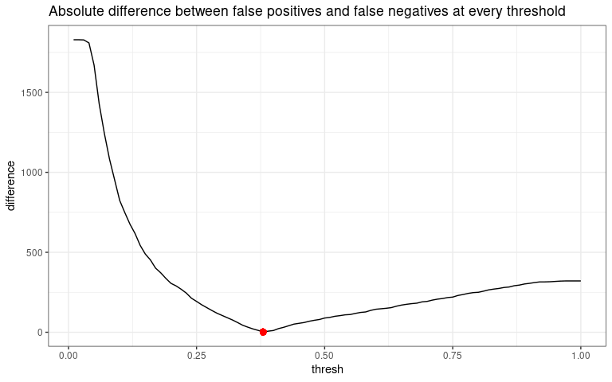
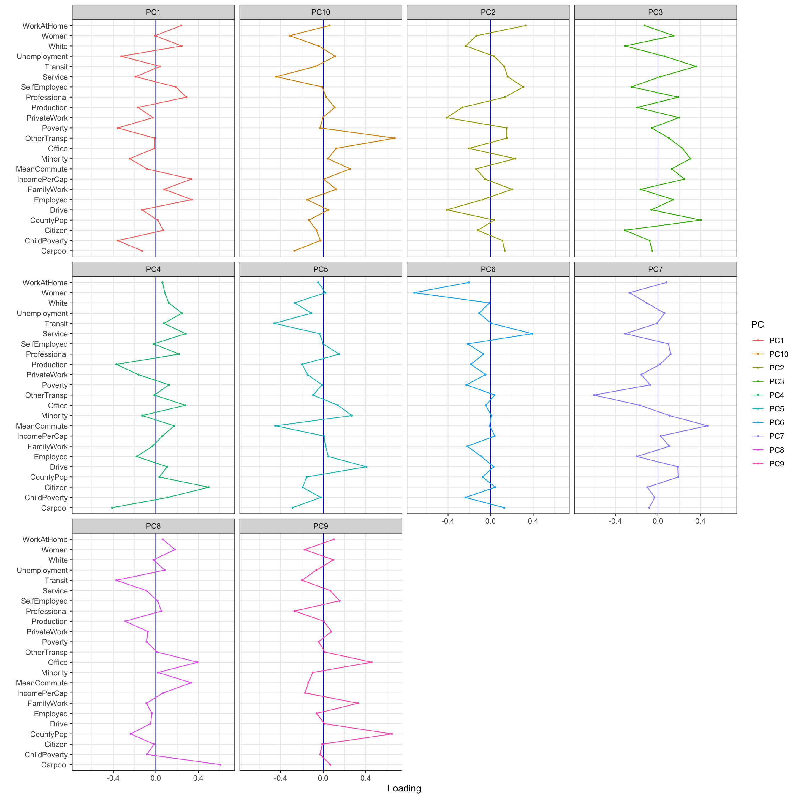

```{r setup, include=FALSE}
knitr::opts_chunk$set(echo = F, 
                      message = F,
                      warning = F,
                      fig.align = 'center',
                      fig.height = 4, 
                      fig.width = 4)

# libraries here
library(pander)
library(tidyverse)
```

# Introduction

The results of US general election 2012 was predicted with considerable high accuracy, especially by Nate Silver's approach. The success of the polling and analysis methods can be attibuted primarily to the fact that the voters who were sampled for survey were honest with their opinion and that whatever change occurred over time was tractable with high accuracy. As we have seen that the voting preferences may change with a change in employment or a shift in federal income tax schemes or an impactful campaign ad. Other sources of variation are sampling error and "house effect". The former implies overrepresentation of voters of one candidate in the sample, and the corrections to such errors by pollsters may be biased due to "house effect". Both these error can be estimated to great degree and adjusted for but the accuracy of polling survey remains the most important and sensitive part of this process.

However, for the General election of 2016, polls and forecasts were generally wrong about the election due to systematic polling challenges. Clinton's projected voteshare was overestimated in most cases, particularly within swing states. Experts have speculated that Trump supporters were reluctant to participate and/or answer honestly to polling questions. This is probably due to the controversies surrounding Donald Trump. On the other hand Hillary was a seasoned politician with well defined agendas and ideas for presidency. 

In this project, we strove to analyze the results of the 2016 federal election at the county level. Our goal was to construct a model that accurately predicts which candidate will receive the most votes in a particular county. A variety of models were trained and tested before arriving at our final selection. The methods that were compared include Logistic Regression, K-Nearest Neighbors, Classification Trees, Random Forest, LDA, and QDA. Principal Component Analysis was implemented to produce a set of principal components that were used as covariates for the models. We trained the models, and the principal components, on a 70% training partition of the data. Models were compared based on their misclassification of the test data. Ultimately, we chose the Random Forest method. We then conducted further analysis to optimize its decision threshold to meet certain criteria, allowing us to arrive at a final model. 


# Materials and methods

Some initial analysis showed that every county in US were won either by Donald Trump or Hillary Clinton. Since we perform our analysis retrospectively with the final winner of the election known, we construct the response as a binary variable with two outcomes 'Don' and 'Hill' respectively meaning that Donald Trump or Hillary Clinton won that particular county.

Let $i=1,2,3,...,n$ be the indicator for counties, and n be total number of counties in US for our analysis. Define,

$$y_i=\left\{\begin{array}{lll}
\text{'Don'} & , & \text { Donald Trump won in i-th county } \\
\text{'Hill'} & , & \text { Hillary Clinton won in i-th county}
\end{array}\right.$$

This particular construction of our response variable was done to facilitate the use of classification models under 
Supervised learning methods we discussed in our PSTAT 131 course. These models are:

1) Logistic Regression
2) K- nearest neighbors
3) Linear Discriminant Analysis
4) Quadratic Discriminant Analysis
5) Regression Tree
6) Random Forest

In each model above we predict the probability of win for Donald Trump, $p_i=P(y_i=1),\,\,\forall i$. Then we consider a threshold $\alpha \in (0,1)$. If the predicted $p_i > \alpha$, then we predict that that Trump won, i.e. $\hat{y_i}=1$, otherwise $\hat{y_i}=0$. Here $\hat{y}_i^M$ is the predicted response for $i^{th}$ county from the model M above.

Then we compute the misclassification for $i^{th}$ county: 
$$z_i^M=\left\{\begin{array}{lll}
0 & , & y_i=\hat{y}_i^M \\
1 & , &  y_i \ne \hat{y}_i^M \\
\end{array}\right.$$

Hence $z_i^M(\alpha)=1$ means a misclassification for the $i^{th}$ county and model M. Then compute $TME^M(\alpha)=\frac{1}{n} \sum_i^n z_i^M(\alpha)$, the total misclassification error for each model and choose the model which gives the minimum of $TME^M(\alpha)$. Here the parameter $\alpha=0.5$ is chosen for our analysis.

However which model turned out the winner optimize for $\alpha$ over a grid of $(0,1)$.

## Datasets

There were two raw data sources used in this project: election and census. These datasets required cleaning and processing which we executed in Stage 1 of this project. The raw election dataset stored federal, state, and county level vote tallies which were then divided into separate datasets. The raw census dataset consisted of higher resolution, demographic information. This data consisted of racial, employment, income, transportation, and location variables.  We aggregated the raw census data to the county level. This allowed us to merge the county level election data set with the aggregated census data. The result was a single dataset containing vote information for the winning candidate and runner-up in each county. Table 1 shows a few rows and columns of the dataset.

> **Table 1**: Example rows and columns of the dataset.

```{r echo = F}
load('~/Documents/Spring2021/PSTAT131/final-project/merged_data2.RData')
head(merged_data2[0:7]) %>% pander()
```

## Methods

### Principal Component Analysis
We began by conducting Principal Component Analysis on the training data. to use as inputs into our supervised methods in determined the winner of each county. This required scaling and centering of the merged data. We then computed loadings for the principal components and plotted them. This allowed us to visualize the variables that were the most influential in determining the value of the principal component. To figure out the correct number of PC's to use in the supervised models we constructed a scree and cumulative variance plot. $$\text{cumulative variance explained}(q) = \frac{\sum_{j = 1}^q\lambda_j}{\sum_{j = 1}^p \lambda_j}$$  We found that the first 8 PC's captured 77.8% of the total variation which was sufficient cumulative variance explained threshold to implement onto our regression models.

> **Table 1**: Scree plot of cumulative and proportion of variance explained by the principal components.

```{r echo = F, out.width = '90%'}

```

### Logistic Regression
The first model we fit was a logistic regression model to predict the the winning candidate in each county during the 2016 presidential election. We trained the model on our principal component training partition (70% of the data), regressing the winning candidate on the first 8 principal components. Moreover, The optimal threshold was computed using Youden's statistic. The accuracy was then assessed on the remaining 30% of the data and the total misclassification rate was calculated in order to compare this model to other models.

### $k$-Nearest Neighbors
The next model we wanted to compare was a $k$-nearest neighbors model. The class labels we used were the winning candidates (either Donald Trump or Hillary Clinton) and leave one out cross validation was performed in order to select the best $k$ that would minimize the error for our model. Like with the logistic regression model, we trained the $k$-nearest neighbors model on a 70% partition of the first 8 principal components data and measured the predictive accuracy based on the remaining 30% by computing the total misclassification error rate.

### Classification Tree
A classification tree was trained, at first, by overfitting a very large tree to the training PC data, then pruning it according to an optimal tuning parameter (k = 21.9) calculated via 25-fold cross validation. We ran the training and test sets through this tree to generate predictions and compute misclassifications. Youden-optimized threshold was also tested on the model. 

### Random Forest
A random forest -- which is an ensemble decision-tree-based method -- was constructed according to the "Adaptive Boosting" scheme. We used 100 trees with 3 interaction terms and 5-fold cross validation. This method produced the best candidates for our final model. The Youden-optimized threshold was tested, as well as two more thresholds that minimized total misclassification and balanced false positives with false negatives to arrive at our preferred model.

### Linear and Quadratic Analysis
For categorical response, and and covariates being Principal components are in euclidean space of p-dimension, we follow similar steps as earlier models and train both the LDA and QDA models on 70% data and test the predictive performance on the rest. The total misclassification error rates turning out to be 0.0837 for the LDA and 0.08913043 for the QDA. Hence LDA performs slightly better. But their performances are not at par with the random forest model discussed above.

# Results

The main metric we used to compare our models was the total misclassification rate. Table 2 shows the total misclassification rate for each model.

> **Table 2**: Total misclassification rate for each model we fit.

```{r echo = F}
missclass <- read.csv('missclass_rates.csv')
missclass %>% pander()
```


## Strongest candidate: Random Forest

The Random Forest model appears to be the strongest candidate because it has the lowest total misclassification rate of any model at the 50% threshold (7.02%) as well as the Youden-optimized threshold (7.39%). Examining these thresholds more closely, we can see that there is room for improvement. Looking at the misclassifiation table for the 50% threshold: 

> **Table 3**: Misclassifications for the random forest model at 50% threshold.

```{r}
data.frame(class = c('Don', 'Hill'),
           Don = c(766,57),
           Hill = c(11, 86)) %>% pander()
```

The total misclassifications are low, but 57 out of the 68  false predictions predict in favor of Donald Trump. This bias can be an effective way of minimizing total misclassification error, but it also ensures that our model will under-represent the counties won by Hillary Clinton. The Youden threshold, which maximizes the difference between True Positive Rate an False Positive Rate, might help to balance this out. Looking at the misclassification table for the Youden threshold of 26%:  

> **Table 4**: Misclassifications for the random forest model at 26% threshold.

```{r}
data.frame(class = c('Don', 'Hill'),
           Don = c(695,19),
           Hill = c(82, 124)) %>% pander()
```

  
The same problem exists with this set of predictions, but this time in favor of Hillary Clinton. We found that all of our models had this problem. The 50% threshold tended to over-predict Donald Trump victories, so we tried using Youden's threshold to shift our predictions in the direction of Clinton, but this resulted in over-prediction of Clinton victories (and with higher total misclassification error). Our revised target is for our prediction errors to be split evenly between both candidates while maintaining low total misclassifications. With this target in mind, we looked for a new optimal threshold.

> **Figure 2**: Line plot of absolute difference between false positives and false negatives against thresholds.

```{r echo = F, out.width = '90%'}

```

For each threshold in the range (0,1), we calculated the resultant absolute difference between false 'Clinton' predictions and false 'Trump' predictions. The threshold of 38% was found to yield the smallest difference. It also yielded a very low total misclassification rate of the training data (6.2%) Applying this threshold to random forest predictions of the test data yielded these misclassifications:

> **Table 5**: Misclassifications for the random forest model at 38% threshold.

```{r}
data.frame(class = c('Don', 'Hill'),
           Don = c(753,33),
           Hill = c(24, 110)) %>% pander()
```
  
These are great results for multiple reasons. The total misclassification error is 6.2% (same as the training data), which is the lowest of any model tested. Additionally, the false 'Clinton' predictions and false 'Trump' predictions are much more balanced, with a ratio of 24:33. Thus, the sums of the predictions are more accurate than any other model. The projected 134 Hillary counties and 786 Trump counties are quite close to the actual totals of the test data which are 143 and 777. This model meets our optimal criteria: yield a low total misclassification rate, and have misclassifications that are split evenly between the candidates. Therefore, it is one of our choices for the final model.


To be thorough in our analysis, we also calculated the model that truly minimizes total misclassification error. We calculated the total training misclassifications at each threshold between 0 and 1, and found that the optimal threshold is 46%. The misclassification table of the test data looks like this:

> **Table 6**: Misclassifications for the random forest model at 46% threshold.

```{r}
data.frame(class = c('Don', 'Hill'),
           Don = c(759,40),
           Hill = c(18, 103)) %>% pander()
```
  
The predictions slightly over-represent Donald trump, with a mistake ratio of 40:18, but the total misclassification rate of 5.99% is the absolute lowest of any model we found. Therefore, we have included it as one of our choices for the best model. 

Furthermore, we analyzed the loading plots for thee first ten principal components to identify the most important covariates.

> **Figure 3**: Loadings plot for the first 10 principal components.

```{r echo = F, out.width = '100%'}

```
The variables with the largest magnitudes suggest that they are most influential. Thus, variables pertaining to transportation, such as `Carpool`, `OtherTransp`, `MeanCommute`, and `Transit`, seem to be the most important. `Women` and `CountyPop` also appear to be important covariates due to their large loading values in principal components 6 and 9, respectively.

# Discussion

By using principal component analysis in our regression models, we were able to build more predictive models. However, this reduced the interpretability of our results. Subsequently, we were unable to identify the demographic variables that were predictive of the election outcome through our models. However, we investigated the loadings for each variable for each principal component to identify important covariates. In our analysis, we fit several different models to the data and computed the total misclassification error rate in order to compare them all. Optimal probability thresholds were also computed using Youden's statistic in order to balance the trade-off between true positive rates and false positive rates. Additionally, we further focused on the random forest model which we ultimately chose to be a candidate model. This model had the lowest total misclassification rate and fit a reasonable criteria of balancing misclassifications between the two candidates.
